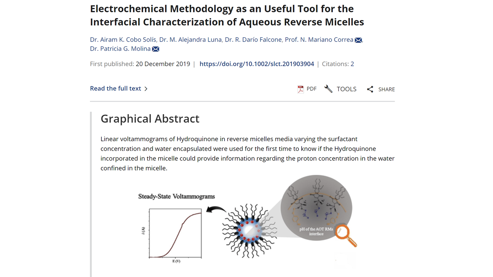

# Proyectos Creativos en Ciencias: Visualización y Tableros de Datos

## Descripción
Bienvenido a mi repositorio de proyectos creativos en ciencias, donde exploro la intersección entre visualización de datos, nanotecnología y ciencias químicas. A lo largo de mi carrera como investigador y docente, he desarrollado múltiples proyectos enfocados en la creación de resúmenes gráficos y tableros de datos interactivos, facilitando la interpretación y análisis de información científica compleja.

Estos proyectos están diseñados no solo para investigadores, sino también para estudiantes, profesionales y público en general interesados en comprender conceptos científicos avanzados de manera visual y accesible.

## Tableros y Resúmenes Gráficos

https://app.powerbi.com/view?r=eyJrIjoiMTY0MTFlNjktZWE4OS00ODA4LThiNTEtY2QyNThmNWE5YmNiIiwidCI6Ijk5ZTFlNzIxLTcxODQtNDk4ZS04YWZmLWIyYWQ0ZTUzYzFjMiIsImMiOjR9&pageName=f211c11a283fcaa998ad

https://app.powerbi.com/view?r=eyJrIjoiNjE4ZGE4MjYtMjQ4Yy00NTJhLWFhZGItZTliOWQwZjNhMGZkIiwidCI6Ijk5ZTFlNzIxLTcxODQtNDk4ZS04YWZmLWIyYWQ0ZTUzYzFjMiIsImMiOjR9

